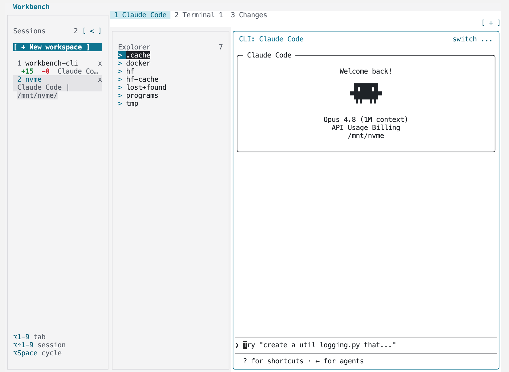
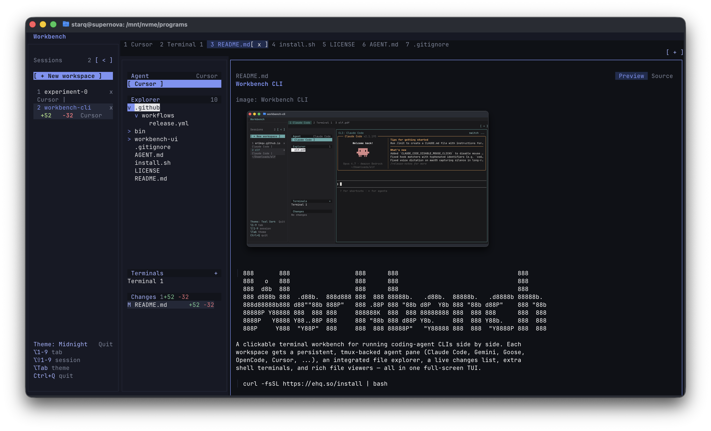

# Workbench CLI

```text
888       888                  888      888                                 888
888   o   888                  888      888                                 888
888  d8b  888                  888      888                                 888
888 d888b 888  .d88b.  888d888 888  888 88888b.   .d88b.  88888b.   .d8888b 88888b.
888d88888b888 d88""88b 888P"   888 .88P 888 "88b d8P  Y8b 888 "88b d88P"    888 "88b
88888P Y88888 888  888 888     888888K  888  888 88888888 888  888 888      888  888
8888P   Y8888 Y88..88P 888     888 "88b 888 d88P Y8b.     888  888 Y88b.    888  888
888P     Y888  "Y88P"  888     888  888 88888P"   "Y88888 888  888  "Y8888P 888  888
```

A clickable terminal workbench for running coding-agent CLIs side by side. Each
workspace gets a persistent, tmux-backed agent pane, a file explorer, live
changes, extra terminals, and rich file viewers in one full-screen TUI.

```bash
curl -fsSL https://ehq.so/install | bash
```



Built with [Bun](https://bun.sh), [React 19](https://react.dev), and
[Silvery](https://www.npmjs.com/package/silvery).

## Install

```bash
curl -fsSL https://ehq.so/install | bash
```

The installer sets up Bun if needed, checks out the source into
`~/.local/share/workbench-cli`, installs dependencies, and links
`workbench-cli` and `work` into `~/.local/bin`.

## Run

```bash
work
```

`workbench-cli` still works too. Open a different directory with
`work path/to/project`, or choose a different agent with `work --harness cursor`.

## Four Commands

The UI is clickable, so these are the main commands to remember:

| Key | Action |
| --- | --- |
| `Ctrl+N` | New workspace |
| `Ctrl+H` | Add or switch agent harness |
| `Ctrl+T` | New terminal |
| `Ctrl+Q` | Quit |

Everything else can be clicked: choose workspaces in the left sidebar, switch to
the agent, browse Explorer files, open changed files, cycle themes, and use the
top-right `+` menu.

## What It Does

- Runs coding agents side by side: Claude Code by default, plus Gemini, Goose,
  OpenCode, and Cursor.
- Keeps agent and terminal panes alive on a private tmux server, so relaunches
  reattach to the same sessions.
- Shows files, terminals, and changes together: Agent, Explorer, Terminals, and
  Changes live in the workspace side pane.
- Renders rich viewers for text, Markdown preview/source, images, PDFs, videos,
  and Mermaid diagrams.



## Development

Development notes, commands, environment variables, optional viewer tools, and
architecture details live in
[`workbench-ui/development/development.md`](workbench-ui/development/development.md).

## Keybindings

| Key | Action |
| --- | --- |
| `Ctrl+T` | New terminal in the active workspace |
| `Ctrl+N` | New workspace (folder picker) |
| `Ctrl+H` | Add a harness (agent) to the active workspace |
| `Ctrl+B` | Toggle the sessions sidebar |
| `Ctrl+W` | Close the active file or terminal tab |
| `Ctrl+Q` | Quit |
| `Tab` / `Shift+Tab` | Cycle top-level tabs when the UI has focus; sent through to focused agents/terminals |
| `Esc` | Return focus to the active agent, terminal, or editor pane |
| `Option+1..9` | Jump to that tab in the active workspace |
| `Option+Shift+1..9` | Jump to that workspace |
| `Option+Space` | Cycle to the next workspace |
| `Option++` | New workspace (opens the agent picker) |
| `Option+Tab` | Cycle the UI theme (`Option+Shift+Tab` reverses) |
| `PageUp` / `PageDown` | Scroll the focused agent / terminal scrollback |

## License

[MIT](LICENSE).
