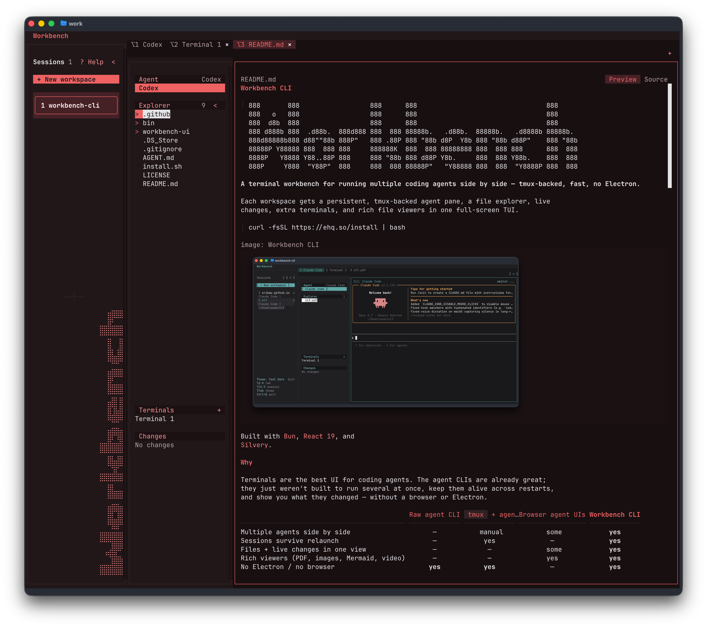
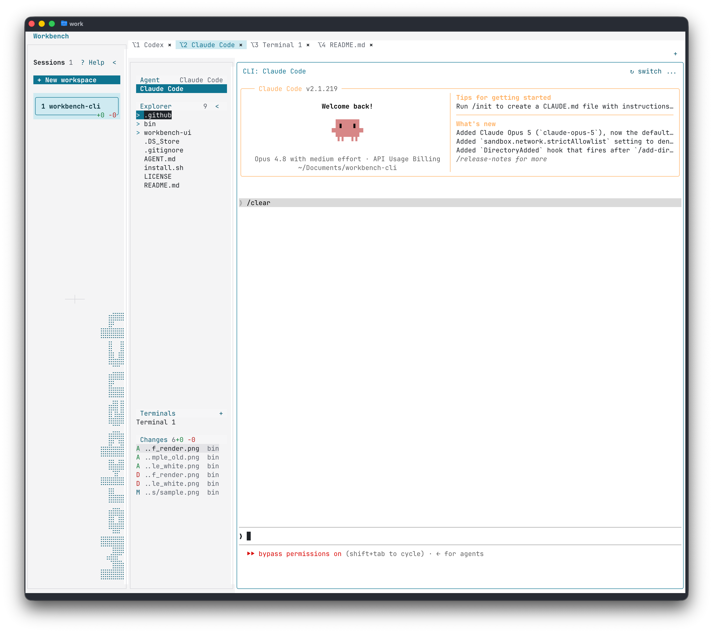

# Workbench CLI

```text
888       888                  888      888                                 888
888   o   888                  888      888                                 888
888  d8b  888                  888      888                                 888
888 d888b 888  .d88b.  888d888 888  888 88888b.   .d88b.  88888b.   .d8888b 88888b.
888d88888b888 d88""88b 888P"   888 .88P 888 "88b d8P  Y8b 888 "88b d88P"    888 "88b
88888P Y88888 888  888 888     888888K  888  888 88888888 888  888 888      888  888
8888P   Y8888 Y88..88P 888     888 "88b 888 d88P Y8b.     888  888 Y88b.    888  888
888P     Y888  "Y88P"  888     888  888 88888P"   "Y88888 888  888  "Y8888P 888  888
```

**A terminal workbench for running coding agents side by side—tmux-backed,
fast, and free of Electron.**

Each workspace gets persistent agent and shell panes, an explorer, live Git
changes, and rich file previews in one full-screen TUI.

```bash
curl -fsSL https://ehq.so/install | bash
```



Built with [Bun](https://bun.sh), [React 19](https://react.dev), and
[Silvery](https://www.npmjs.com/package/silvery).

## Highlights

- Run Cursor, Claude Code, Gemini, Codex, and OpenCode in separate persistent
  harness tabs.
- Keep agents and terminals alive across Workbench restarts through a private
  tmux server.
- Open several workspaces and switch directly with visible Option-number hints.
- Inspect Explorer files and live Git changes beside the active harness.
- Preview Markdown, Mermaid diagrams, images, PDFs, and video.
- Use the mouse for tabs, session cards, resizing, selection, and scrolling.
- Open the complete in-app shortcut guide from `? Help` or `Ctrl+?`.

## Terminal Support

Workbench is developed and tested in [Ghostty](https://ghostty.org). Other
terminals may work, especially Kitty-compatible or Sixel-capable ones, but are
experimental and may differ in rendering, mouse input, images, cursor behavior,
or tmux passthrough.

The outer terminal controls the live TUI font. JetBrains Mono is recommended;
14–16 px is a good starting point. The browser-backed test harness bundles
JetBrains Mono so screenshots remain deterministic.

## Install and Update

Install from source:

```bash
curl -fsSL https://ehq.so/install | bash
```

The installer:

1. Ensures a compatible Bun is available.
2. Checks out Workbench under `~/.local/share/workbench-cli` by default.
3. Installs the package dependencies.
4. Links both `workbench-cli` and `work` into `~/.local/bin`.

Update an existing installation manually with either form:

```bash
work update
workbench-cli update
```

The updater preserves the checkout and launcher locations. It refuses to
overwrite an installation checkout with local changes. Workbench does not
silently auto-update itself.

## Run

```bash
work
work path/to/project
work --harness claude
work --splash
work path/to/project --harness codex --hot
```

`workbench-cli` is the equivalent long command. The path defaults to the current
directory. If a path entered in the New Workspace dialog does not exist,
Workbench creates it recursively.

Available harness IDs are `codex`, `cursor`, `claude`, `gemini`, and `opencode`.
For a new installation Workbench prefers the first installed CLI in this order:
Codex, Cursor, then Claude Code; it falls back to Codex when none can be
detected. Override the choice with `--harness`, `--agent`, or
`WORKBENCH_UI_HARNESS_ID`.

Use Codex and Claude Code in the same Workbench workspace, with each agent kept
alive in its own tab:



Use `work --splash` to hold the startup artwork on screen until the first key
press or click, which is useful for previewing it at the current terminal size.

Every new workspace starts with one harness and one shell terminal, both rooted
in that workspace directory.

## Interface

- **Sessions:** outlined workspace cards on the left. The selected card is
  themed, hovering highlights a card, and a flowing lower edge indicates a
  running harness. Right-click for Close Others, Close to the Top, and Close to
  the Bottom.
- **Tabs:** harnesses, terminals, Changes, and files across the top. Right-click
  for Close Others, Close to the Left, and Close to the Right.
- **Workspace pane:** active harness, Explorer, Terminals, and Changes.
- **Harness header:** restart the current harness in place with `↻`, or use
  `switch ...` to add/select another harness.
- **Help:** click `? Help` or press `Ctrl+?` for the current command guide.

Closing a tab or workspace kills its backing private tmux pane immediately.
Quitting Workbench only detaches panes so they can be restored on the next run.

## Keyboard Shortcuts

| Key | Action |
| --- | --- |
| `Ctrl+?` | Toggle the Help overlay (requires a terminal with an enhanced keyboard protocol) |
| `Ctrl+N` | New workspace |
| `Ctrl+H` | Add or switch harness |
| `Ctrl+T` | New terminal in the active workspace |
| `Ctrl+B` | Toggle the sessions pane |
| `Ctrl+W` | Close the active closable tab when UI focus owns the key |
| `Ctrl+S` | Save the active editable buffer when UI focus owns the key |
| `Ctrl+Q` | Quit Workbench |
| `Option+1..9` | Select the numbered top tab |
| `Option+Shift+1..9` | Select the numbered workspace session |
| `Option+Space` | Select the next workspace session |
| `Option++` | New workspace |
| `Option+Tab` / `Option+Shift+Tab` | Cycle the theme forward/backward |
| `Tab` / `Shift+Tab` | Cycle tabs when UI focus owns the key; otherwise pass through to the PTY |
| `PageUp` / `PageDown` | Navigate the focused harness or terminal viewport |
| `Ctrl+C` / `Ctrl+V` | Copy a selection / request clipboard paste in terminal and viewer surfaces |

When a harness or shell owns focus, ordinary keys—including its own shortcuts—
are sent to that PTY. Clickable Help remains available if the terminal cannot
distinguish `Ctrl+?` from Backspace.

## Persistence and Local Data

Workbench stores layout and tab identity in
`~/.workbench/workbench-ui-state.json`. Agent and terminal processes run on the
private tmux socket `~/.workbench/tmux-ui.sock`; Workbench never uses or destroys
the user's normal tmux server.

## Development

Start with [the development guide](workbench-ui/development/development.md).
Package-specific runtime notes live in [workbench-ui/README.md](workbench-ui/README.md),
and invariants for coding agents live in [AGENT.md](AGENT.md).

## License

[MIT](LICENSE)
