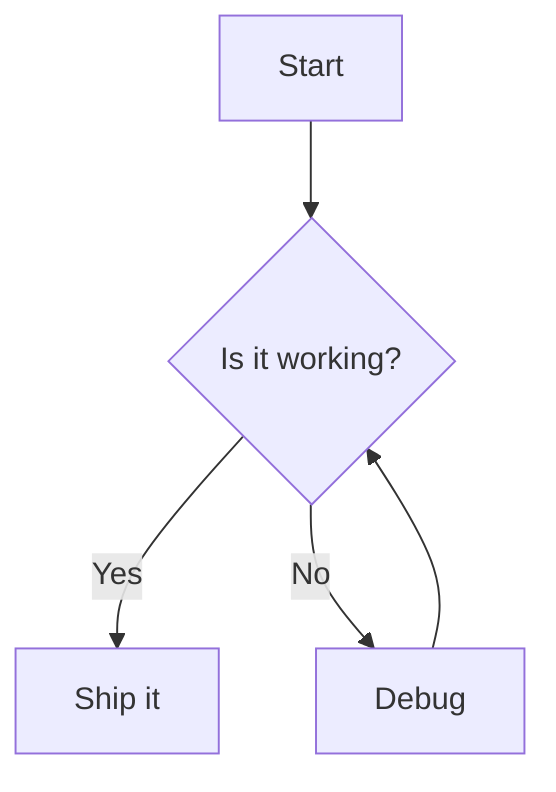

# Diagram

A short paragraph before the diagram.

## Wide table bounds

| Short | A deliberately oversized table column that must stay inside the preview pane | Tail |
| --- | --- | --- |
| alpha | WIDE_TABLE_CELL_ABCDEFGHIJKLMNOPQRSTUVWXYZ_ABCDEFGHIJKLMNOPQRSTUVWXYZ_ABCDEFGHIJKLMNOPQRSTUVWXYZ_ABCDEFGHIJKLMNOPQRSTUVWXYZ_ABCDEFGHIJKLMNOPQRSTUVWXYZ | omega |

Text after the diagram.
